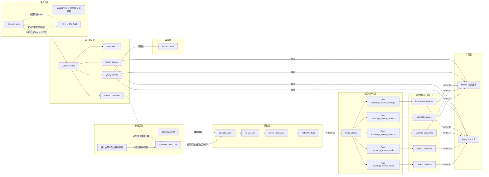
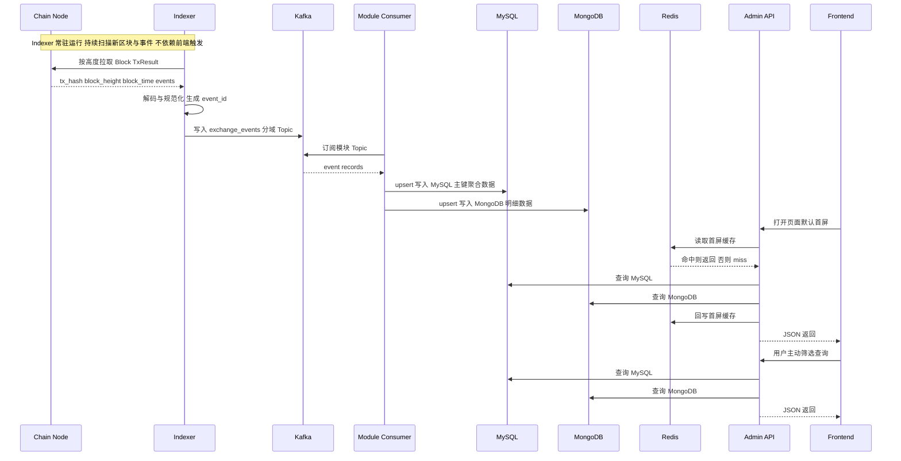
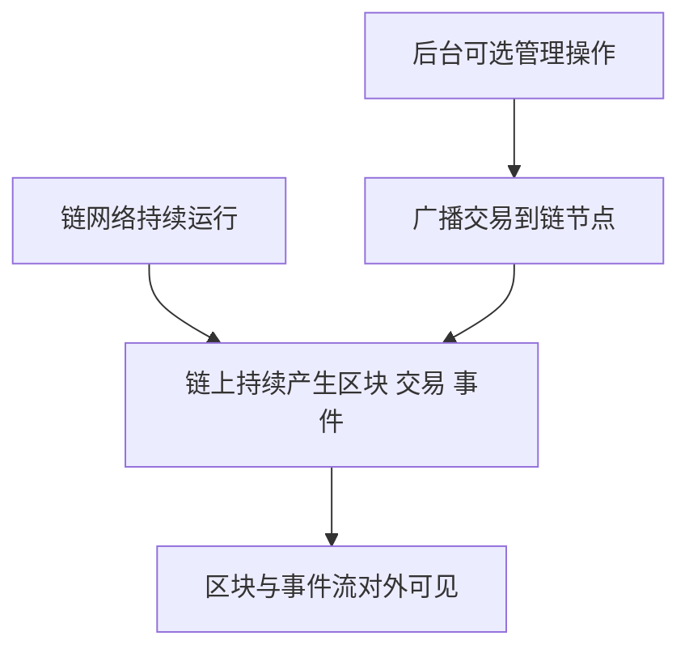
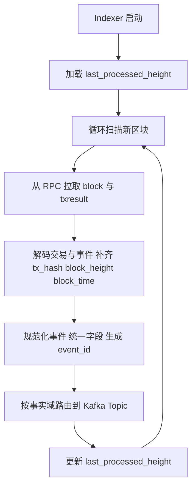
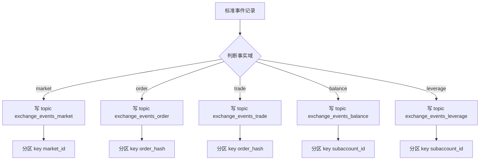
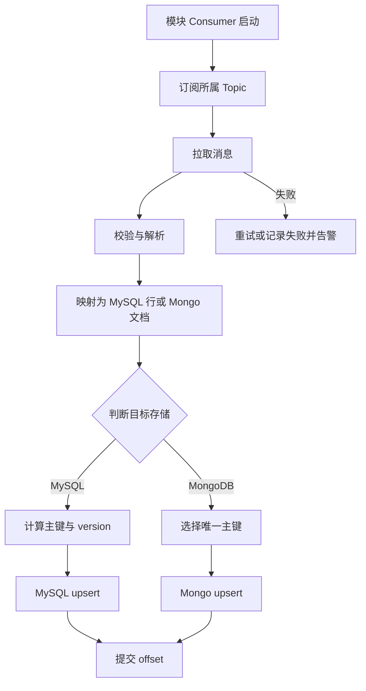
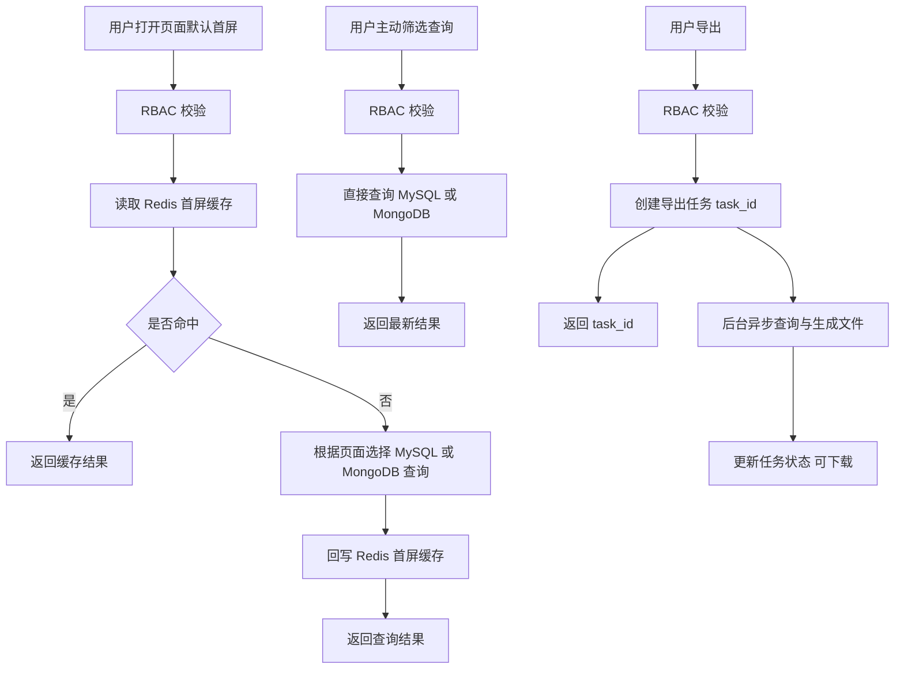
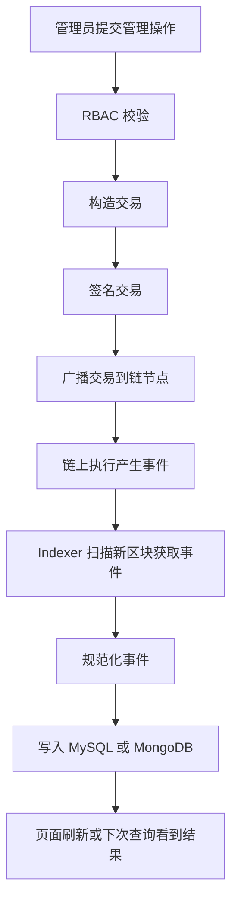

# DEX 后台管理系统技术方案（Biya/StockDEX）

> 本文是后续开发的**统一技术规范与落地方案**。依据与对齐文档：
>
> - `docs/后台管理系统产品需求文档.md`
> - `docs/后台原型.html`
> - `docs/链上事件和接口梳理.md`（数据来源口径以此为准）
>
> 版本：V1.0

---

## 0. 目标、边界与核心约束

### 0.1 目标

- **支撑内部人员稳定查询与导出**：订单/资金/资金明细等核心页面，在数据持续增长下仍能稳定筛选、排序、分页与导出（通过分库分表与分片扩展）。
- **链上为真源、链下可追溯**：链上事件/Query 是真源，链下仅做索引与聚合；所有关键数据可回溯到 `tx_hash / order_hash / height`。
- **统一工程栈与复用能力**：公共能力抽象出来（链上采集、解析、幂等、分页、token/market 映射、价格服务、对账口径等），避免重复造轮子。

### 0.2 边界

- **链上暂不支持的字段**：以 `docs/链上事件和接口梳理.md` 标注为准。真正开发时再决策：
  - 方案 A：链改（修改 `Injective-core`，新增事件/字段/Query，并补齐相应 keeper 逻辑）
  - 方案 B：链下验证推导（必须可追溯到 tx_hash/height 的可验证口径）
  - 方案 C：产品口径调整/降级展示
- **链改工作**：链改需要内部单独评审、排期与发布流程；本方案会持续维护“链改候选清单/优先级/影响范围”，开发阶段逐项落地。

### 0.3 强约束

- **数据库**：采用 **MySQL + MongoDB** 的存储模式（按数据模型选择存储，并做好分库分表与分片）。
- **缓存**：统一使用 **Redis**，并明确 TTL 与同步/失效策略。
- **语言**：统一 **Go**。
- **Web 路由**：统一 **Gin**。
- **消息中间件**：统一 **Kafka**（采集与落库解耦、缓冲削峰、可重放）；Topic 按“事实域”拆分（market/order/trade/balance/leverage）。

---

## 1. 架构图

### 1.1 系统整体架构图

**架构图名称**：Biya DEX Manager 链上数据管道与后台 API 服务架构



**架构说明**：

- **分层数量**：8 层（数据源层、采集层、消息中间件层、消费处理层、存储层、缓存层、API 服务层、客户端层）
- **一级模块**：8 个（与分层一一对应）
- **二级模块**：CometBFT RPC、Cosmos gRPC、Block Scanner、Tx Decoder、Event Normalizer、Kafka Producer、Kafka Cluster、Topic exchange_events_market、Topic exchange_events_order、Topic exchange_events_trade、Topic exchange_events_balance、Topic exchange_events_leverage、Market Consumer、Order Consumer、Trade Consumer、Balance Consumer、Leverage Consumer、MySQL 分库分表、MongoDB 分片、Redis Cache、Admin API Gin、Auth RBAC、Query Service、Export Service、Admin Tx Service、Web Console、登录认证服务
- **中间件**：Kafka、Redis
- **接口**：
  - 链节点 → 采集：RPC_WS / GRPC
  - 前端 → API：HTTP_JSON
  - API → MySQL：SQL
  - API → MongoDB：Query
  - API → Redis：RESP
  - API → 链节点：BROADCAST_TX（管理操作上链）
- **触发关系澄清**：采集层是常驻任务，持续从链上同步区块与事件，**不依赖前端触发**；前端只在“管理操作需要上链”时通过 `API_TX` 可选地广播交易，随后同样会被采集链路回流入库。
- **核心流程**：链上数据采集 → Kafka（按事实域分 Topic）→ 模块 Consumer 幂等落库 MySQL/MongoDB → API 查询与导出（首屏缓存优先）→ 管理后台前端展示；管理操作通过 API 上链后再由事件回流入库。

### 1.2 数据流架构图（从链到页面）



---

## 2. 流程图（关键业务链路）

> 说明：本章只描述“框架级整体流程”，字段口径以 `docs/链上事件和接口梳理.md` 为准。

### 2.1 数据源层流程（链自然产生为主 管理上链为辅）



### 2.2 采集层流程（常驻扫描 解码 规范化 路由）



### 2.3 消息中间件层流程（按事实域分 Topic 分区保证同实体有序）



### 2.4 消费处理层流程（模块 Consumer 幂等落库）



### 2.5 API 服务层流程（首屏缓存优先 主动查询回源 更新缓存）



### 2.6 管理操作上链流程（可选入口 上链后由采集回流更新）



---

## 3. 技术栈选型

### 3.1 开发语言：Go

- **理由**：高并发、生态成熟、与 Injective/Cosmos 相关工具链匹配度高，适合构建稳定的采集与后台 API。

### 3.2 Web 路由：Gin

- **理由**：性能高、路由与中间件生态成熟（日志、恢复、CORS、鉴权、限流等）。
- **约定**：统一使用 `/api/v1` 前缀；统一 JSON 响应结构；统一 trace_id。

### 3.3 数据库：MySQL + MongoDB

- **结论**：采用 **MySQL + MongoDB** 的存储模式。
- **MySQL 定位**：主键聚合型数据与维表类数据（适合 upsert、约束、事务与一致性），并做分库分表以应对增长压力。
- **MongoDB 定位**：明细型增长数据（按时间持续增长，适合按用户与时间范围查询），并做分片与归档策略。

### 3.4 缓存：Redis

- **定位**：缓存维表（market/token/decimals）、热点聚合（首页看板）、分布式锁、导出任务状态等。
- **一致性**：TTL + 主动失效 + 可选定期刷新三策略，避免“永不过期脏数据”。

### 3.5 消息队列：Kafka

- **定位**：作为采集层与落库层之间的**解耦层**，提供缓冲削峰、失败隔离、可重放与多消费者扩展能力。
- **Topic（按事实域）**：
  - `biya.dexmgr.exchange_events.market.v1`（市场与交易对变更）
  - `biya.dexmgr.exchange_events.order.v1`（订单生命周期）
  - `biya.dexmgr.exchange_events.trade.v1`（成交明细）
  - `biya.dexmgr.exchange_events.balance.v1`（充提/划转/资金变动）
  - `biya.dexmgr.exchange_events.leverage.v1`（理财/借贷池）
- **投递语义**：至少一次（At-least-once），因此落库必须幂等（MySQL 主键 upsert、Mongo 唯一键 upsert + block_height version 防倒灌）。

---

## 4. 系统模块与公共能力抽象

### 4.1 进程/服务拆分

- **`cmd/indexer`**：链上扫描与事件规范化 → 写入 Kafka（按事实域分 Topic）。
- **`cmd/consumer`**：模块化消费 Kafka → 按页面与数据模型落库 MySQL/MongoDB（幂等 upsert + version 防倒灌）。
- **`cmd/api`**：Gin 后端 API（查询/导出/缓存/管理操作上链），并内置后台任务执行器（默认首屏缓存刷新、清理过期缓存等）。

> 代码层面必须“模块解耦”，上述进程服务在同一个工程中按模块进行划分，每个模块独立进行部署（Docker 优先）实现解耦，避免一个服务挂了影响整体。

### 4.2 必须抽象成公共包的能力（避免重复实现）

- **链上连接层**：CometBFT RPC + gRPC Client、重试、限速、熔断。
- **事件解析与规范化**：把不同事件统一成“可入库/可重放”的结构（带 tx_hash/height/block_time）。
- **幂等与去重**：统一的 `dedupe_key`、`version` 生成规则。
- **分页器**：统一 cursor/seek 分页协议（避免 offset 深分页）。
- **维表服务**：market/token/decimals 的同步与缓存（并提供统一查询接口）。
- **价格服务**：USDT 估值需要的价格快照/现价缓存（以 `SpotMidPriceAndTOB` 或 oracle 为源）。
- **导出任务框架**：统一异步导出（任务表 + 进度 + 文件生成/下载）。
- **审计日志**：所有管理操作统一落审计表（满足 PRD 附录 B）。

---

## 5. 数据来源与口径（链上）

### 5.1 统一原则

- **字段来源**：严格以 `docs/链上事件和接口梳理.md` 为准（事件/Query/计算口径）。

### 5.2 数据类型划分（决定存储策略）

- **主键聚合型（Upsert）**：以主键为单位维护“最新状态”的数据 → **MySQL**（upsert），并做分库分表。
- **明细型（增长型）**：按时间持续增长的记录 → **MongoDB**（upsert 或 insert），并做分片与索引。
- **维表类（小表）**：token/market/user/admin/权限等 → **MySQL** 维表 + Redis 缓存。

> 页面与存储的对应关系：
>
> - MySQL：首页 用户管理 交易对管理 资金管理 理财币种配置 理财统计 资金池 资金池统计
> - MongoDB：普通订单 充值管理 提现管理 资金明细 理财记录

---

## 6. 数据库设计（MySQL + MongoDB）

> 目标：满足内部使用的查询与导出需求，在数据增长下可通过 MySQL 分库分表与 MongoDB 分片扩展；链上为真源，链下数据可追溯到 tx_hash 等元信息。

### 6.1 存储分工（按页面与数据模型）

- **MySQL（主键聚合型）**：保存“一个主键一行”的数据与维表数据（upsert 维护最新状态）
  - 页面：**首页、用户管理、交易对管理、资金管理、理财币种配置、理财统计、资金池、资金池统计**
- **MongoDB（明细增长型）**：保存“按时间增长的明细记录”（面向列表查询与下载）
  - 页面：**普通订单、充值管理、提现管理、资金明细、理财记录**

统一要求：

- **追溯字段**：所有记录建议带 `tx_hash block_height block_time event_id`
- **幂等写入**：同一条链上事件重复处理时，不得产生重复记录（依赖主键或唯一索引 upsert）

### 6.2 MySQL 表清单

> 说明：命名可按团队习惯调整，以下以 `dws_` 表示“页面可直接查询的主键聚合表”。
>
> - 存储引擎：InnoDB
> - 字符集：utf8mb4
> - 金额/数量/比率：统一 `DECIMAL(36,18)`（展示时再做四舍五入）
> - 时间：统一 `DATETIME(3)`，日维度用 `DATE`
> - 分库分表：物理拆分时可先按 shard **分库**（库名后缀 `_00.._15`），必要时再 **分表**（表名后缀 `_00.._15`）；建表语句保持一致（这里展示逻辑表）

#### 6.2.1 首页看板（1 对多：最新汇总 + 趋势）

- **关系**：
  - 卡片区：1 行（最新汇总）
  - 趋势图：N 行（按日）

```sql
CREATE TABLE `dws_dashboard` (
  `id` TINYINT UNSIGNED NOT NULL COMMENT '固定=1',
  `yesterday_register_count` INT UNSIGNED NOT NULL DEFAULT 0 COMMENT '昨日注册人数',
  `yesterday_trade_amount_usdt` DECIMAL(36,18) NOT NULL DEFAULT 0 COMMENT '昨日交易额（USDT）',
  `yesterday_order_count` BIGINT UNSIGNED NOT NULL DEFAULT 0 COMMENT '昨日订单数',
  `yesterday_deposit_usdt` DECIMAL(36,18) NOT NULL DEFAULT 0 COMMENT '昨日充值（USDT）',
  `yesterday_withdraw_usdt` DECIMAL(36,18) NOT NULL DEFAULT 0 COMMENT '昨日提现（USDT）',
  `total_register_count` BIGINT UNSIGNED NOT NULL DEFAULT 0 COMMENT '总注册人数',
  `total_trade_amount_usdt` DECIMAL(36,18) NOT NULL DEFAULT 0 COMMENT '总交易额（USDT）',
  `total_order_count` BIGINT UNSIGNED NOT NULL DEFAULT 0 COMMENT '总订单数',
  `total_deposit_usdt` DECIMAL(36,18) NOT NULL DEFAULT 0 COMMENT '总充值（USDT）',
  `total_withdraw_usdt` DECIMAL(36,18) NOT NULL DEFAULT 0 COMMENT '总提现（USDT）',
  `last_updated_at` DATETIME(3) NOT NULL COMMENT '数据更新时间（聚合产出时间）',
  `updated_at` DATETIME(3) NOT NULL DEFAULT CURRENT_TIMESTAMP(3) ON UPDATE CURRENT_TIMESTAMP(3),
  PRIMARY KEY (`id`)
) ENGINE=InnoDB DEFAULT CHARSET=utf8mb4 COMMENT='首页看板最新汇总（固定一行）';

CREATE TABLE `dws_dashboard_daily` (
  `dt` DATE NOT NULL COMMENT '统计日期',
  `register_count` INT UNSIGNED NOT NULL DEFAULT 0 COMMENT '注册人数',
  `trade_amount_usdt` DECIMAL(36,18) NOT NULL DEFAULT 0 COMMENT '交易额（USDT）',
  `order_count` BIGINT UNSIGNED NOT NULL DEFAULT 0 COMMENT '订单数',
  `deposit_usdt` DECIMAL(36,18) NOT NULL DEFAULT 0 COMMENT '充值（USDT）',
  `withdraw_usdt` DECIMAL(36,18) NOT NULL DEFAULT 0 COMMENT '提现（USDT）',
  `last_updated_at` DATETIME(3) NOT NULL COMMENT '数据更新时间',
  `created_at` DATETIME(3) NOT NULL DEFAULT CURRENT_TIMESTAMP(3),
  `updated_at` DATETIME(3) NOT NULL DEFAULT CURRENT_TIMESTAMP(3) ON UPDATE CURRENT_TIMESTAMP(3),
  PRIMARY KEY (`dt`),
  KEY `idx_updated_at` (`updated_at`)
) ENGINE=InnoDB DEFAULT CHARSET=utf8mb4 COMMENT='首页看板按日趋势';
```

#### 6.2.2 用户管理（1 对 1：列表行=详情弹窗）

- **关系**：列表一行就是一个用户；“查看”弹窗展示的禁用信息等字段也落在同一行。

```sql
CREATE TABLE `dws_user` (
  `user_id` VARCHAR(32) NOT NULL COMMENT '产品用户ID，例如 U001',
  `subaccount_id` CHAR(64) NOT NULL COMMENT '链上子账户ID（64 hex）',
  `wallet_address` VARCHAR(128) NULL COMMENT '钱包地址（Bech32），可为空',
  `email` VARCHAR(128) NULL COMMENT '邮箱，可为空',
  `registered_at` DATETIME(3) NULL COMMENT '注册时间（若无注册概念可用首次活跃时间）',
  `total_asset_value_usdt` DECIMAL(36,18) NOT NULL DEFAULT 0 COMMENT '总估值（USDT）',
  `total_deposit_usdt` DECIMAL(36,18) NOT NULL DEFAULT 0 COMMENT '总转入（USDT）',
  `total_withdraw_usdt` DECIMAL(36,18) NOT NULL DEFAULT 0 COMMENT '总转出（USDT）',
  `realized_pnl_usdt` DECIMAL(36,18) NOT NULL DEFAULT 0 COMMENT '已实现盈亏（USDT）',
  `unrealized_pnl_usdt` DECIMAL(36,18) NOT NULL DEFAULT 0 COMMENT '未实现盈亏（USDT）',
  `interest_paid_usdt` DECIMAL(36,18) NOT NULL DEFAULT 0 COMMENT '累计支付利息（USDT）',
  `status` TINYINT NOT NULL DEFAULT 1 COMMENT '状态：1正常 0禁用交易',
  `disabled_at` DATETIME(3) NULL COMMENT '禁用时间',
  `disabled_reason` VARCHAR(255) NULL COMMENT '禁用原因',
  `disabled_by_admin_id` VARCHAR(32) NULL COMMENT '禁用操作人（管理员ID）',
  `updated_at` DATETIME(3) NOT NULL DEFAULT CURRENT_TIMESTAMP(3) ON UPDATE CURRENT_TIMESTAMP(3),
  PRIMARY KEY (`user_id`),
  UNIQUE KEY `uk_subaccount_id` (`subaccount_id`),
  KEY `idx_wallet_address` (`wallet_address`),
  KEY `idx_status` (`status`),
  KEY `idx_registered_at` (`registered_at`)
) ENGINE=InnoDB DEFAULT CHARSET=utf8mb4 COMMENT='用户管理（聚合视图）';
```

#### 6.2.3 交易对管理（Spot Market，1 对 1：列表行=详情弹窗）

- **关系**：列表一行就是一个 market；“查看详情/添加交易对”弹窗字段落在同一行。

```sql
CREATE TABLE `dws_market` (
  `market_id` CHAR(64) NOT NULL COMMENT 'market_id（64 hex）',
  `ticker` VARCHAR(64) NOT NULL COMMENT '交易对代码，如 AAPL-USDT',
  `base_denom` VARCHAR(128) NOT NULL COMMENT '交易币种 denom',
  `quote_denom` VARCHAR(128) NOT NULL COMMENT '结算币种 denom',
  `maker_fee_rate` DECIMAL(36,18) NOT NULL DEFAULT 0 COMMENT 'maker 手续费率',
  `taker_fee_rate` DECIMAL(36,18) NOT NULL DEFAULT 0 COMMENT 'taker 手续费率',
  `min_price_tick_size` DECIMAL(36,18) NOT NULL DEFAULT 0 COMMENT '价格步长',
  `min_quantity_tick_size` DECIMAL(36,18) NOT NULL DEFAULT 0 COMMENT '数量步长',
  `min_notional` DECIMAL(36,18) NOT NULL DEFAULT 0 COMMENT '最小金额',
  `amount_tick_size` DECIMAL(36,18) NULL COMMENT '金额步长（若链上无则由产品/链改定义）',
  `min_quantity` DECIMAL(36,18) NULL COMMENT '最小数量（若链上无则由产品/链改定义）',
  `max_quantity` DECIMAL(36,18) NULL COMMENT '最大数量（若链上无则由产品/链改定义）',
  `max_notional` DECIMAL(36,18) NULL COMMENT '最大金额（若链上无则由产品/链改定义）',
  `initial_margin_ratio_long` DECIMAL(36,18) NULL COMMENT '做多初始保证金率（产品配置）',
  `maintenance_margin_ratio_long` DECIMAL(36,18) NULL COMMENT '做多维持保证金率（产品配置）',
  `initial_margin_ratio_short` DECIMAL(36,18) NULL COMMENT '做空初始保证金率（产品配置）',
  `maintenance_margin_ratio_short` DECIMAL(36,18) NULL COMMENT '做空维持保证金率（产品配置）',
  `status` TINYINT NOT NULL DEFAULT 1 COMMENT '状态：1正常交易 2下架中',
  `created_time` DATETIME(3) NULL COMMENT '业务口径创建时间',
  `updated_time` DATETIME(3) NULL COMMENT '业务口径更新时间',
  `block_height` BIGINT NULL COMMENT '链上高度（最后一次更新）',
  `tx_hash` CHAR(64) NULL COMMENT '链上交易哈希（最后一次更新）',
  `event_id` VARCHAR(128) NULL COMMENT '事件ID（最后一次更新）',
  `created_at` DATETIME(3) NOT NULL DEFAULT CURRENT_TIMESTAMP(3),
  `updated_at` DATETIME(3) NOT NULL DEFAULT CURRENT_TIMESTAMP(3) ON UPDATE CURRENT_TIMESTAMP(3),
  PRIMARY KEY (`market_id`),
  UNIQUE KEY `uk_ticker` (`ticker`),
  KEY `idx_status` (`status`),
  KEY `idx_base_denom` (`base_denom`),
  KEY `idx_quote_denom` (`quote_denom`),
  KEY `idx_updated_time` (`updated_time`)
) ENGINE=InnoDB DEFAULT CHARSET=utf8mb4 COMMENT='交易对管理（Spot Market）';
```

#### 6.2.4 资金管理（余额快照，1 对 1：列表行=一个 subaccount+denom）

```sql
CREATE TABLE `dws_balance` (
  `subaccount_id` CHAR(64) NOT NULL COMMENT '链上子账户ID（64 hex）',
  `user_id` VARCHAR(32) NULL COMMENT '产品用户ID（可选冗余）',
  `denom` VARCHAR(128) NOT NULL COMMENT '币种 denom',
  `available` DECIMAL(36,18) NOT NULL DEFAULT 0 COMMENT '可用',
  `balance_hold` DECIMAL(36,18) NOT NULL DEFAULT 0 COMMENT '冻结/占用',
  `total` DECIMAL(36,18) NOT NULL DEFAULT 0 COMMENT '总余额',
  `computed_balance` DECIMAL(36,18) NOT NULL DEFAULT 0 COMMENT '计算余额（口径由产品定义）',
  `difference` DECIMAL(36,18) NOT NULL DEFAULT 0 COMMENT '余额差',
  `mismatch_flag` TINYINT NOT NULL DEFAULT 0 COMMENT '异常标记：1异常 0正常',
  `usdt_value` DECIMAL(36,18) NULL COMMENT '估值（USDT）',
  `snapshot_at` DATETIME(3) NULL COMMENT '快照时间',
  `block_height` BIGINT NULL COMMENT '链上高度',
  `tx_hash` CHAR(64) NULL COMMENT '链上交易哈希（用于追溯）',
  `event_id` VARCHAR(128) NULL COMMENT '事件ID（用于追溯）',
  `created_at` DATETIME(3) NOT NULL DEFAULT CURRENT_TIMESTAMP(3),
  `updated_at` DATETIME(3) NOT NULL DEFAULT CURRENT_TIMESTAMP(3) ON UPDATE CURRENT_TIMESTAMP(3),
  PRIMARY KEY (`subaccount_id`, `denom`),
  KEY `idx_user_id` (`user_id`),
  KEY `idx_denom` (`denom`),
  KEY `idx_mismatch_flag` (`mismatch_flag`),
  KEY `idx_snapshot_at` (`snapshot_at`)
) ENGINE=InnoDB DEFAULT CHARSET=utf8mb4 COMMENT='资金管理余额快照（subaccount+denom 最新一行）';
```

#### 6.2.5 理财币种配置（1 对 1：列表行=配置行）

```sql
CREATE TABLE `dws_earn_currency_config` (
  `denom` VARCHAR(128) NOT NULL COMMENT '币种 denom',
  `symbol` VARCHAR(64) NULL COMMENT '展示用符号（可选）',
  `current_supply_apy` DECIMAL(36,18) NOT NULL DEFAULT 0 COMMENT '当前年化收益率',
  `min_subscribe_amount` DECIMAL(36,18) NOT NULL DEFAULT 0 COMMENT '最小申购金额',
  `status` TINYINT NOT NULL DEFAULT 1 COMMENT '状态：1上架 0下架',
  `base_interest_rate` DECIMAL(36,18) NULL COMMENT '基础利率',
  `optimal_utilization_rate` DECIMAL(36,18) NULL COMMENT '最优利用率',
  `interest_rate_slope1` DECIMAL(36,18) NULL COMMENT '第一段斜率',
  `interest_rate_slope2` DECIMAL(36,18) NULL COMMENT '第二段斜率',
  `platform_share_ratio` DECIMAL(36,18) NULL COMMENT '协议抽成',
  `created_time` DATETIME(3) NULL COMMENT '创建时间（业务口径）',
  `updated_time` DATETIME(3) NULL COMMENT '更新时间（业务口径）',
  `block_height` BIGINT NULL,
  `tx_hash` CHAR(64) NULL,
  `event_id` VARCHAR(128) NULL,
  `created_at` DATETIME(3) NOT NULL DEFAULT CURRENT_TIMESTAMP(3),
  `updated_at` DATETIME(3) NOT NULL DEFAULT CURRENT_TIMESTAMP(3) ON UPDATE CURRENT_TIMESTAMP(3),
  PRIMARY KEY (`denom`),
  KEY `idx_status` (`status`),
  KEY `idx_updated_time` (`updated_time`)
) ENGINE=InnoDB DEFAULT CHARSET=utf8mb4 COMMENT='理财币种配置';
```

#### 6.2.6 理财统计（1 对多：卡片汇总 + 用户列表）

```sql
CREATE TABLE `dws_earn_stats` (
  `dt` DATE NOT NULL COMMENT '统计日期',
  `total_subscribe_usdt` DECIMAL(36,18) NOT NULL DEFAULT 0 COMMENT '总申购金额（USDT）',
  `total_redeem_usdt` DECIMAL(36,18) NOT NULL DEFAULT 0 COMMENT '总赎回金额（USDT）',
  `total_income_usdt` DECIMAL(36,18) NOT NULL DEFAULT 0 COMMENT '总收益（USDT）',
  `active_user_count` INT UNSIGNED NOT NULL DEFAULT 0 COMMENT '活跃用户数',
  `mom_growth_rate` DECIMAL(36,18) NULL COMMENT '较上月增长（比例或差值，按产品定义）',
  `last_updated_at` DATETIME(3) NOT NULL COMMENT '数据更新时间',
  `created_at` DATETIME(3) NOT NULL DEFAULT CURRENT_TIMESTAMP(3),
  `updated_at` DATETIME(3) NOT NULL DEFAULT CURRENT_TIMESTAMP(3) ON UPDATE CURRENT_TIMESTAMP(3),
  PRIMARY KEY (`dt`)
) ENGINE=InnoDB DEFAULT CHARSET=utf8mb4 COMMENT='理财统计按日汇总（卡片区）';

CREATE TABLE `dws_earn_user_stats` (
  `dt` DATE NOT NULL COMMENT '统计日期',
  `user_id` VARCHAR(32) NOT NULL COMMENT '用户ID（产品口径）',
  `supplier_address` VARCHAR(128) NULL COMMENT '链上主账户地址（Bech32）',
  `subscribe_usdt` DECIMAL(36,18) NOT NULL DEFAULT 0 COMMENT '申购金额（USDT）',
  `redeem_usdt` DECIMAL(36,18) NOT NULL DEFAULT 0 COMMENT '赎回金额（USDT）',
  `net_subscribe_usdt` DECIMAL(36,18) NOT NULL DEFAULT 0 COMMENT '净申购（USDT）',
  `income_usdt` DECIMAL(36,18) NOT NULL DEFAULT 0 COMMENT '总收益（USDT）',
  `last_updated_at` DATETIME(3) NOT NULL COMMENT '数据更新时间',
  `created_at` DATETIME(3) NOT NULL DEFAULT CURRENT_TIMESTAMP(3),
  `updated_at` DATETIME(3) NOT NULL DEFAULT CURRENT_TIMESTAMP(3) ON UPDATE CURRENT_TIMESTAMP(3),
  PRIMARY KEY (`dt`, `user_id`),
  KEY `idx_user_id` (`user_id`),
  KEY `idx_supplier_address` (`supplier_address`)
) ENGINE=InnoDB DEFAULT CHARSET=utf8mb4 COMMENT='理财统计按日-用户聚合（列表区）';
```

#### 6.2.7 资金池（1 对多：池子最新 + 历史利率）

```sql
CREATE TABLE `dws_lending_pool` (
  `denom` VARCHAR(128) NOT NULL COMMENT '币种 denom',
  `symbol` VARCHAR(64) NULL COMMENT '展示用符号（可选）',
  `total_supply` DECIMAL(36,18) NOT NULL DEFAULT 0 COMMENT '池子总资金量',
  `total_borrowed` DECIMAL(36,18) NOT NULL DEFAULT 0 COMMENT '已借出总量',
  `utilization_rate` DECIMAL(36,18) NOT NULL DEFAULT 0 COMMENT '资金利用率',
  `borrow_rate` DECIMAL(36,18) NOT NULL DEFAULT 0 COMMENT '借款年化利率',
  `supply_rate` DECIMAL(36,18) NOT NULL DEFAULT 0 COMMENT '存款年化利率',
  `staker_count` INT UNSIGNED NOT NULL DEFAULT 0 COMMENT '质押用户数',
  `borrower_count` INT UNSIGNED NOT NULL DEFAULT 0 COMMENT '借款用户数',
  `base_interest_rate` DECIMAL(36,18) NULL COMMENT '基础利率（全局或按币种，按产品定义）',
  `optimal_utilization_rate` DECIMAL(36,18) NULL COMMENT '最优利用率',
  `interest_rate_slope1` DECIMAL(36,18) NULL COMMENT '第一段斜率',
  `interest_rate_slope2` DECIMAL(36,18) NULL COMMENT '第二段斜率',
  `platform_share_ratio` DECIMAL(36,18) NULL COMMENT '协议抽成',
  `updated_time` DATETIME(3) NULL COMMENT '更新时间（业务口径）',
  `block_height` BIGINT NULL,
  `tx_hash` CHAR(64) NULL,
  `event_id` VARCHAR(128) NULL,
  `created_at` DATETIME(3) NOT NULL DEFAULT CURRENT_TIMESTAMP(3),
  `updated_at` DATETIME(3) NOT NULL DEFAULT CURRENT_TIMESTAMP(3) ON UPDATE CURRENT_TIMESTAMP(3),
  PRIMARY KEY (`denom`),
  KEY `idx_updated_time` (`updated_time`)
) ENGINE=InnoDB DEFAULT CHARSET=utf8mb4 COMMENT='资金池最新状态（每币种一行）';

CREATE TABLE `dws_lending_rate_history` (
  `denom` VARCHAR(128) NOT NULL COMMENT '币种 denom',
  `snapshot_time` DATETIME(3) NOT NULL COMMENT '快照时间',
  `utilization_rate` DECIMAL(36,18) NOT NULL DEFAULT 0 COMMENT '资金利用率',
  `borrow_rate` DECIMAL(36,18) NOT NULL DEFAULT 0 COMMENT '借款年化利率',
  `supply_rate` DECIMAL(36,18) NOT NULL DEFAULT 0 COMMENT '存款年化利率',
  `total_supply` DECIMAL(36,18) NOT NULL DEFAULT 0 COMMENT '池子总资金量',
  `total_borrowed` DECIMAL(36,18) NOT NULL DEFAULT 0 COMMENT '已借出总量',
  `block_height` BIGINT NULL,
  `tx_hash` CHAR(64) NULL,
  `event_id` VARCHAR(128) NULL,
  `created_at` DATETIME(3) NOT NULL DEFAULT CURRENT_TIMESTAMP(3),
  PRIMARY KEY (`denom`, `snapshot_time`),
  KEY `idx_snapshot_time` (`snapshot_time`)
) ENGINE=InnoDB DEFAULT CHARSET=utf8mb4 COMMENT='资金池历史利率与规模快照（用于历史弹窗）';
```

#### 6.2.8 资金池统计（1 对 1：每币种一行）

```sql
CREATE TABLE `dws_lending_pool_stats` (
  `denom` VARCHAR(128) NOT NULL COMMENT '币种 denom',
  `symbol` VARCHAR(64) NULL COMMENT '展示用符号（可选）',
  `total_supply_cumulative` DECIMAL(36,18) NOT NULL DEFAULT 0 COMMENT '累计存入',
  `total_borrow_cumulative` DECIMAL(36,18) NOT NULL DEFAULT 0 COMMENT '累计借出',
  `supplier_count` INT UNSIGNED NOT NULL DEFAULT 0 COMMENT '存入人数',
  `borrower_count` INT UNSIGNED NOT NULL DEFAULT 0 COMMENT '借出人数',
  `borrow_interest_income_usdt` DECIMAL(36,18) NOT NULL DEFAULT 0 COMMENT '借款利息收入（USDT）',
  `staker_interest_distributed_usdt` DECIMAL(36,18) NOT NULL DEFAULT 0 COMMENT '质押利息分配（USDT）',
  `protocol_share_usdt` DECIMAL(36,18) NOT NULL DEFAULT 0 COMMENT '协议抽成（USDT）',
  `updated_time` DATETIME(3) NULL COMMENT '更新时间（业务口径）',
  `created_at` DATETIME(3) NOT NULL DEFAULT CURRENT_TIMESTAMP(3),
  `updated_at` DATETIME(3) NOT NULL DEFAULT CURRENT_TIMESTAMP(3) ON UPDATE CURRENT_TIMESTAMP(3),
  PRIMARY KEY (`denom`),
  KEY `idx_updated_time` (`updated_time`)
) ENGINE=InnoDB DEFAULT CHARSET=utf8mb4 COMMENT='资金池统计（每币种一行）';
```

### 6.3 MongoDB 集合清单

> 说明：
>
> - 对标 MySQL：给出**集合字段设计、主键策略、索引设计**与**一对多关系拆分**。
> - 数值字段建议使用 **Decimal128**（或 string + 精度约定），避免 double 精度问题。
> - 时间字段统一使用 **ISODate**（对应 `DATETIME(3)`）。
> - 校验（validator）建议 `validationLevel: "moderate"`，保证结构正确但不影响灰度补字段。

#### 6.3.1 普通订单（1 对多：订单 + 逐笔成交）

- **页面**：订单管理 → 普通订单列表 + 成交明细弹窗
- **关系**：
  - `orders`（1 行 = 1 个订单最新状态）
  - `order_trades`（N 行 = 该订单的逐笔成交记录，用于“成交明细”弹窗表格）

**集合：`orders`（订单最新状态）**

- **主键**：`_id = order_hash`
- **字段（覆盖列表 + 弹窗）**：
  - 基础：`user_id`、`subaccount_id`、`market_id`、`ticker`
  - 订单：`order_type`、`side`、`status`、`limit_price`、`orig_qty`、`orig_amount`
  - 成交聚合：`filled_qty`、`filled_amount`、`avg_price`、`fee_total`、`fee_denom`、`trade_count`
  - 成本与盈亏：`cost_price`、`realized_pnl`
  - 时间：`created_at`、`updated_at`、`last_trade_at`
  - 追溯：`tx_hash`、`block_height`、`event_id`

```javascript
db.createCollection("orders", {
  validator: {
    $jsonSchema: {
      bsonType: "object",
      required: [
        "_id",
        "subaccount_id",
        "market_id",
        "order_type",
        "side",
        "status",
        "created_at",
      ],
      properties: {
        _id: { bsonType: "string", description: "order_hash" },
        user_id: { bsonType: ["string", "null"], description: "产品用户ID" },
        subaccount_id: { bsonType: "string" },
        market_id: { bsonType: "string" },
        ticker: { bsonType: ["string", "null"] },

        order_type: { bsonType: "string", description: "LIMIT/MARKET" },
        side: { bsonType: "string", description: "BUY/SELL" },
        status: {
          bsonType: "string",
          description: "待成交/已成交/已撤销/失败等",
        },

        limit_price: { bsonType: ["decimal", "null"] },
        orig_qty: { bsonType: ["decimal", "null"] },
        orig_amount: { bsonType: ["decimal", "null"] },

        filled_qty: { bsonType: ["decimal", "null"] },
        filled_amount: { bsonType: ["decimal", "null"] },
        avg_price: { bsonType: ["decimal", "null"] },
        fee_total: { bsonType: ["decimal", "null"] },
        fee_denom: { bsonType: ["string", "null"] },
        trade_count: { bsonType: ["int", "long", "null"] },

        cost_price: { bsonType: ["decimal", "null"] },
        realized_pnl: { bsonType: ["decimal", "null"] },

        created_at: { bsonType: "date" },
        updated_at: { bsonType: ["date", "null"] },
        last_trade_at: { bsonType: ["date", "null"] },

        tx_hash: { bsonType: ["string", "null"] },
        block_height: { bsonType: ["long", "int", "null"] },
        event_id: { bsonType: ["string", "null"] },
      },
    },
  },
  validationLevel: "moderate",
});

db.orders.createIndex(
  { user_id: 1, created_at: -1 },
  { name: "idx_user_created_at" }
);
db.orders.createIndex(
  { subaccount_id: 1, created_at: -1 },
  { name: "idx_subaccount_created_at" }
);
db.orders.createIndex(
  { market_id: 1, created_at: -1 },
  { name: "idx_market_created_at" }
);
db.orders.createIndex(
  { status: 1, created_at: -1 },
  { name: "idx_status_created_at" }
);
db.orders.createIndex(
  { ticker: 1, created_at: -1 },
  { name: "idx_ticker_created_at" }
);
```

**集合：`order_trades`（逐笔成交记录）**

- **主键**：`_id = order_hash + "#" + trade_index`（或 `tx_hash + "#" + trade_index`，保证全局唯一）
- **字段（对应弹窗“逐笔成交记录”表格）**：
  - `order_hash`、`trade_index`
  - `block_time`、`tx_hash`、`block_height`
  - `price`、`quantity`、`amount`
  - `fee`、`fee_denom`

```javascript
db.createCollection("order_trades", {
  validator: {
    $jsonSchema: {
      bsonType: "object",
      required: [
        "_id",
        "order_hash",
        "trade_index",
        "block_time",
        "price",
        "quantity",
      ],
      properties: {
        _id: { bsonType: "string" },
        order_hash: { bsonType: "string" },
        trade_index: { bsonType: ["int", "long"] },

        block_time: { bsonType: "date" },
        tx_hash: { bsonType: ["string", "null"] },
        block_height: { bsonType: ["long", "int", "null"] },

        price: { bsonType: "decimal" },
        quantity: { bsonType: "decimal" },
        amount: { bsonType: ["decimal", "null"] },

        fee: { bsonType: ["decimal", "null"] },
        fee_denom: { bsonType: ["string", "null"] },
      },
    },
  },
  validationLevel: "moderate",
});

db.order_trades.createIndex(
  { order_hash: 1, trade_index: 1 },
  { name: "uk_order_trade", unique: true }
);
db.order_trades.createIndex(
  { order_hash: 1, block_time: 1 },
  { name: "idx_order_time" }
);
db.order_trades.createIndex({ tx_hash: 1 }, { name: "idx_tx_hash" });
```

#### 6.3.2 充值管理（1 对 1：列表行=详情弹窗）

- **页面**：充值管理 → 列表 + 查看详情
- **集合**：`deposits`
- **主键**：`_id = deposit_no`（产品充值订单号），并保留 `tx_hash`

**字段（覆盖列表 + 详情）**：

- 列表：`deposit_no`、`user_id`、`subaccount_id`、`denom/symbol`、`amount`、`created_at`、`confirmed_at`、`status`
- 详情：`deposit_address`、`tx_hash`、`block_height`、`confirmations`、`network`、`memo`、`remark`
- 审核：`audit.by_admin_id`、`audit.remark`、`audit.updated_at`

```javascript
db.createCollection("deposits", {
  validator: {
    $jsonSchema: {
      bsonType: "object",
      required: [
        "_id",
        "user_id",
        "subaccount_id",
        "denom",
        "amount",
        "created_at",
        "status",
      ],
      properties: {
        _id: { bsonType: "string", description: "deposit_no" },
        deposit_no: {
          bsonType: ["string", "null"],
          description: "冗余字段，可与 _id 相同",
        },

        user_id: { bsonType: "string" },
        subaccount_id: { bsonType: "string" },
        address_or_email: { bsonType: ["string", "null"] },

        denom: { bsonType: "string" },
        symbol: { bsonType: ["string", "null"] },
        amount: { bsonType: "decimal" },

        created_at: { bsonType: "date" },
        confirmed_at: { bsonType: ["date", "null"] },
        status: { bsonType: "string", description: "完成/待确认/失败" },

        deposit_address: { bsonType: ["string", "null"] },
        tx_hash: { bsonType: ["string", "null"] },
        block_height: { bsonType: ["long", "int", "null"] },
        confirmations: { bsonType: ["int", "long", "null"] },
        network: { bsonType: ["string", "null"] },
        memo: { bsonType: ["string", "null"] },
        remark: { bsonType: ["string", "null"] },

        audit: {
          bsonType: ["object", "null"],
          properties: {
            by_admin_id: { bsonType: ["string", "null"] },
            remark: { bsonType: ["string", "null"] },
            updated_at: { bsonType: ["date", "null"] },
          },
        },
      },
    },
  },
  validationLevel: "moderate",
});

db.deposits.createIndex(
  { user_id: 1, created_at: -1 },
  { name: "idx_user_created_at" }
);
db.deposits.createIndex(
  { subaccount_id: 1, created_at: -1 },
  { name: "idx_subaccount_created_at" }
);
db.deposits.createIndex(
  { denom: 1, created_at: -1 },
  { name: "idx_denom_created_at" }
);
db.deposits.createIndex(
  { status: 1, created_at: -1 },
  { name: "idx_status_created_at" }
);
db.deposits.createIndex({ tx_hash: 1 }, { name: "idx_tx_hash", sparse: true });
```

#### 6.3.3 提现管理（1 对 1：列表行=详情弹窗）

- **页面**：提现管理 → 列表 + 查看详情
- **集合**：`withdrawals`
- **主键**：`_id = withdraw_no`（产品提现 ID），并保留 `tx_hash`

**字段（覆盖列表 + 详情）**：

- 列表：`withdraw_no`、`user_id`、`from_subaccount_id`、`denom/symbol`、`protocol`、`amount`、`fee`、`net_amount`、`withdraw_address`、`status`、`applied_at`、`processed_at`
- 详情：`tx_hash`、`block_height`、`confirmations`、`network`、`memo`、`remark`
- 审核：`audit.by_admin_id`、`audit.remark`、`audit.updated_at`

```javascript
db.createCollection("withdrawals", {
  validator: {
    $jsonSchema: {
      bsonType: "object",
      required: [
        "_id",
        "user_id",
        "from_subaccount_id",
        "denom",
        "amount",
        "applied_at",
        "status",
      ],
      properties: {
        _id: { bsonType: "string", description: "withdraw_no" },
        withdraw_no: {
          bsonType: ["string", "null"],
          description: "冗余字段，可与 _id 相同",
        },

        user_id: { bsonType: "string" },
        from_subaccount_id: { bsonType: "string" },
        address_or_email: { bsonType: ["string", "null"] },

        denom: { bsonType: "string" },
        symbol: { bsonType: ["string", "null"] },
        protocol: { bsonType: ["string", "null"] },
        amount: { bsonType: "decimal" },
        fee: { bsonType: ["decimal", "null"] },
        net_amount: { bsonType: ["decimal", "null"] },
        withdraw_address: { bsonType: ["string", "null"] },

        status: { bsonType: "string", description: "待确认/已确认/失败" },
        applied_at: { bsonType: "date" },
        processed_at: { bsonType: ["date", "null"] },

        tx_hash: { bsonType: ["string", "null"] },
        block_height: { bsonType: ["long", "int", "null"] },
        confirmations: { bsonType: ["int", "long", "null"] },
        network: { bsonType: ["string", "null"] },
        memo: { bsonType: ["string", "null"] },
        remark: { bsonType: ["string", "null"] },

        audit: {
          bsonType: ["object", "null"],
          properties: {
            by_admin_id: { bsonType: ["string", "null"] },
            remark: { bsonType: ["string", "null"] },
            updated_at: { bsonType: ["date", "null"] },
          },
        },
      },
    },
  },
  validationLevel: "moderate",
});

db.withdrawals.createIndex(
  { user_id: 1, applied_at: -1 },
  { name: "idx_user_applied_at" }
);
db.withdrawals.createIndex(
  { from_subaccount_id: 1, applied_at: -1 },
  { name: "idx_subaccount_applied_at" }
);
db.withdrawals.createIndex(
  { denom: 1, applied_at: -1 },
  { name: "idx_denom_applied_at" }
);
db.withdrawals.createIndex(
  { status: 1, applied_at: -1 },
  { name: "idx_status_applied_at" }
);
db.withdrawals.createIndex(
  { tx_hash: 1 },
  { name: "idx_tx_hash", sparse: true }
);
```

#### 6.3.4 资金明细（明细增长型：一条流水一行）

- **页面**：资金明细 → 列表（筛选/导出/显示异常）
- **集合**：`fund_details`
- **主键**：`_id = flow_id`（建议：`event_id + "#" + denom + "#" + leg_index`，或按你们内部规则生成）
- **字段（覆盖列表）**：
  - `user_id`、`subaccount_id`
  - `denom/symbol`
  - `op_type`（买入/卖出/充值/提现/理财申购/理财赎回/其他...）
  - `amount`（正负号按产品规则）
  - `fee`、`fee_denom`
  - `occurred_at`
  - `ref_type` + `ref_id`（订单号/tx_hash/order_hash 等）
  - `post_balance`、`computed_balance`、`difference`、`mismatch_flag`
  - 追溯：`tx_hash`、`block_height`、`event_id`

```javascript
db.createCollection("fund_details", {
  validator: {
    $jsonSchema: {
      bsonType: "object",
      required: [
        "_id",
        "user_id",
        "subaccount_id",
        "denom",
        "op_type",
        "amount",
        "occurred_at",
      ],
      properties: {
        _id: { bsonType: "string", description: "flow_id" },
        user_id: { bsonType: "string" },
        subaccount_id: { bsonType: "string" },

        denom: { bsonType: "string" },
        symbol: { bsonType: ["string", "null"] },

        op_type: { bsonType: "string" },
        amount: { bsonType: "decimal" },
        fee: { bsonType: ["decimal", "null"] },
        fee_denom: { bsonType: ["string", "null"] },

        occurred_at: { bsonType: "date" },

        ref_type: { bsonType: ["string", "null"] },
        ref_id: { bsonType: ["string", "null"] },

        post_balance: { bsonType: ["decimal", "null"] },
        computed_balance: { bsonType: ["decimal", "null"] },
        difference: { bsonType: ["decimal", "null"] },
        mismatch_flag: { bsonType: ["int", "long", "null"] },

        tx_hash: { bsonType: ["string", "null"] },
        block_height: { bsonType: ["long", "int", "null"] },
        event_id: { bsonType: ["string", "null"] },
      },
    },
  },
  validationLevel: "moderate",
});

db.fund_details.createIndex(
  { user_id: 1, occurred_at: -1 },
  { name: "idx_user_time" }
);
db.fund_details.createIndex(
  { subaccount_id: 1, occurred_at: -1 },
  { name: "idx_subaccount_time" }
);
db.fund_details.createIndex(
  { denom: 1, occurred_at: -1 },
  { name: "idx_denom_time" }
);
db.fund_details.createIndex(
  { op_type: 1, occurred_at: -1 },
  { name: "idx_op_time" }
);
db.fund_details.createIndex(
  { mismatch_flag: 1, occurred_at: -1 },
  { name: "idx_mismatch_time" }
);
db.fund_details.createIndex({ ref_id: 1 }, { name: "idx_ref_id" });
```

#### 6.3.5 理财记录（1 对 1：列表行=详情弹窗）

- **页面**：理财记录 → 列表 + 查看详情（链上交易信息区）
- **集合**：`earn_records`
- **主键**：`_id = record_no`（产品订单号/记录号）

**字段（覆盖列表 + 详情）**：

- 列表：`record_no`、`user_id`、`subaccount_id`/`supplier_address`、`denom/symbol`、`op_type`（申购/赎回）、`amount`、`status`、`created_at`、`finished_at`
- 详情（链上交易信息）：`tx_hash`、`block_height`、`confirmations`、`gas_fee`、`chain_status`、`network`

```javascript
db.createCollection("earn_records", {
  validator: {
    $jsonSchema: {
      bsonType: "object",
      required: [
        "_id",
        "user_id",
        "denom",
        "op_type",
        "amount",
        "status",
        "created_at",
      ],
      properties: {
        _id: { bsonType: "string", description: "record_no" },
        record_no: {
          bsonType: ["string", "null"],
          description: "冗余字段，可与 _id 相同",
        },

        user_id: { bsonType: "string" },
        subaccount_id: { bsonType: ["string", "null"] },
        supplier_address: { bsonType: ["string", "null"] },

        denom: { bsonType: "string" },
        symbol: { bsonType: ["string", "null"] },
        op_type: { bsonType: "string", description: "申购/赎回" },
        amount: { bsonType: "decimal" },
        status: { bsonType: "string", description: "成功/失败" },

        created_at: { bsonType: "date" },
        finished_at: { bsonType: ["date", "null"] },

        tx_hash: { bsonType: ["string", "null"] },
        block_height: { bsonType: ["long", "int", "null"] },
        confirmations: { bsonType: ["int", "long", "null"] },
        gas_fee: { bsonType: ["decimal", "null"] },
        chain_status: { bsonType: ["string", "null"] },
        network: { bsonType: ["string", "null"] },
      },
    },
  },
  validationLevel: "moderate",
});

db.earn_records.createIndex(
  { user_id: 1, created_at: -1 },
  { name: "idx_user_created_at" }
);
db.earn_records.createIndex(
  { denom: 1, created_at: -1 },
  { name: "idx_denom_created_at" }
);
db.earn_records.createIndex(
  { op_type: 1, created_at: -1 },
  { name: "idx_op_created_at" }
);
db.earn_records.createIndex(
  { status: 1, created_at: -1 },
  { name: "idx_status_created_at" }
);
db.earn_records.createIndex(
  { tx_hash: 1 },
  { name: "idx_tx_hash", sparse: true }
);
```

### 6.4 幂等写入规则（落地约束）

- **MySQL**：推荐 `INSERT ... ON DUPLICATE KEY UPDATE`，并用 `block_height` 作为 version 或 sequence，避免旧事件覆盖新状态。
- **MongoDB**：推荐 `updateOne({ _id }, { $set: doc }, { upsert: true })`；对状态字段同样可用 `block_height` 防止倒灌。

---

## 7. 分库分表与分片设计

### 7.1 MySQL 分库分表

> 目标：随着数据增长可平滑扩容，避免单库单表过大影响查询与导出。

#### 7.1.1 分片对象与存放位置

- **不分片（全局/小表）**：放到一个独立库，例如 `dexmgr_meta`，便于全局查询。
  - 典型：`dws_dashboard`、`dws_dashboard_daily`、`dws_market`、`dws_earn_currency_config`、`dws_earn_stats`、`dws_lending_pool`、`dws_lending_rate_history`、`dws_lending_pool_stats`、RBAC 表、系统配置表等。
- **分片（用户维度大表）**：按 shard key 水平拆分到多库，例如 `dexmgr_u00`..`dexmgr_u15`（或更大）。
  - 典型：`dws_balance`（用户 × 币种）、`dws_earn_user_stats`（用户 × 日期）、`dws_user`（未来可能用户量上涨）等。

> 说明：这里推荐“**分库不分表**”作为默认形态——每个 shard 库内表名保持一致（仍叫 `dws_balance`），运维与代码都更简单；当单 shard 内表仍然过大时，再考虑“分库 + 分表”。

#### 7.1.2 Shard Key 选择与路由规则

- **原则**：选一个能稳定拿到、且和查询条件强相关的 key，避免每次查询都扫全 shard。
- **推荐 shard key**：
  - `dws_balance`：用 `subaccount_id`（天然存在、与页面用户一致、且主键包含该字段）
  - `dws_earn_user_stats`：用 `user_id`（用户 id 和子账户有关联，也可直接用 `subaccount_id` 作为 shard key）
- **Hash 规则（示例）**：
  - `shard_count = 16`
  - `shard_id = crc32(lower(key)) % shard_count`
  - 库名：`dexmgr_u{shard_id:02d}`（`dexmgr_u00`..`dexmgr_u15`）

> 查询路由建议：API 收到 `user_id` 的场景，先从 `dws_user`（或映射表）拿到 `subaccount_id`，再按 `subaccount_id` 路由到目标 shard，避免“按 user_id 扫全 shard”。

#### 7.1.3 读写路径的分片约束

- **写入（Consumer）**：
  - 只做**单 shard 写**（按 shard key 路由），不做跨 shard 事务。
  - 幂等更新：继续沿用唯一键/主键 + `block_height` 防倒灌。
- **读取（API）**：
  - **强烈建议列表页查询条件必须包含 shard key 或可转换为 shard key**（例如先查到 `subaccount_id`）。

### 7.2 MongoDB 分片与索引

#### 7.2.1 分片键选择

> 目标：让**列表页的高频查询**尽量“定向到少量 shard”，避免全 shard 扫描。

- **`orders`（订单列表）**：
  - 推荐 shard key：`subaccount_id`（或 `user_id`）做 **hashed** 分片（均衡写入 + 按用户查询可定向）
  - 常用查询：`subaccount_id + created_at`、`market_id + created_at`、`status + created_at`
- **`order_trades`（订单成交明细）**：
  - 推荐 shard key：`order_hash`（hashed），因为弹窗查询天然带 `order_hash`，可定向
- **`deposits/withdrawals/earn_records/fund_details`（明细列表）**：
  - 推荐 shard key：`subaccount_id`（或 `user_id`）hashed
  - 原因：后台筛选大多按用户维度 + 时间范围，hash 分片能把不同用户均匀铺开

#### 7.2.2 索引设计原则（对标列表页筛选）

- **统一规则**：列表页几乎都需要“按时间倒序”，所以索引要覆盖“筛选字段 + 时间字段”：
  - 例如订单：`{ subaccount_id: 1, created_at: -1 }`
  - 例如资金明细：`{ subaccount_id: 1, occurred_at: -1 }`
- **组合索引优先**：尽量用 2~4 个覆盖核心筛选路径的组合索引，避免索引过多导致写放大。
- **唯一约束**：
  - 若要在 sharded collection 上建 unique index，务必保证 unique key **包含 shard key 前缀**（MongoDB 的硬约束）。
  - 注意：如果 `_id` 不是 shard key，MongoDB 只保证**每个 shard 内** `_id` 唯一；应用侧需保证 `_id` 全局唯一（例如使用全局唯一 ID 或把 shard key 编进 `_id`）。
  - 因此建议 `_id` 或业务唯一键在设计时就考虑携带 shard key 信息（例如 `subaccount_id#order_hash` 这种形式），以便既幂等又可扩展。

#### 7.2.3 分页/导出

- **分页**：避免 `skip/limit` 深翻页；统一使用游标分页（如 `created_at + _id` 作为 cursor）。
- **查询约束**：
  - 高频列表接口尽量要求带 `subaccount_id/user_id` 或可转换条件（从而定向到 shard）
  - 无用户条件的全量扫描仅允许用于导出，并带严格时间范围 + 限流。

## 8. 缓存设计（Redis）

### 8.1 缓存对象

- **页面首屏缓存（核心）**：
  - 目的：打开页面时优先命中缓存，秒开；用户“主动查询/筛选”时再回源 MySQL 或 MongoDB 获取最新结果。
  - 示例：
    - 订单列表默认首屏：`page:order:list:default`
    - 资金管理默认首屏：`page:balance:list:default`
    - 充值/提现默认首屏：`page:deposit:list:default` / `page:withdraw:list:default`
  - 形态：直接缓存“接口返回 JSON”（含列表数据 + 游标 + last_updated_at），避免二次拼装。
- **维表缓存**：
  - `market_id -> market_info`
  - `denom -> decimals/symbol`
- **热点聚合缓存**：
  - 首页看板 `dashboard:latest`
  - `last_updated_at`

### 8.2 缓存一致性与同步周期

- **打开页面（默认查询）**：API **cache-first**，优先读页面首屏缓存；miss 时回源 MySQL 或 MongoDB 并回写缓存。
- **用户主动查询/筛选**：API **db-first**（直接查 MySQL 或 MongoDB），返回最新结果；通常不对“高基数筛选条件”做缓存，避免缓存爆炸。
- **TTL 策略**：
  - 页面首屏缓存：建议 10~30s（按页面 QPS 与可接受延迟调整）
  - 维表缓存：默认 1h
  - 首页看板：默认 60~300s
- **定期同步**：API 内置后台任务周期性刷新上述默认首屏 key（读取 MySQL 或 MongoDB → 写 Redis）。

---

## 9. 接口

> 说明：
>
> - 存储层（MySQL/MongoDB）的表/集合、Consumer 的写入、内部回补/运维工具等**不作为对外接口暴露**。
> - **前端可调用的对外 API（HTTP/JSON）**：页面列表、详情、导出、以及少量需要上链的管理动作。

### 9.1 对外 API 清单（按页面模块）

- **首页**
  - `GET /api/v1/dashboard`：看板最新汇总
  - `GET /api/v1/dashboard/daily`：趋势图（支持 7D/30D/90D 或自定义时间范围）
- **用户管理**
  - `GET /api/v1/users`：用户列表
  - `GET /api/v1/users/{user_id}`：用户详情
  - `POST /api/v1/users/{user_id}/actions/disable`：禁用交易（如需要上链则走 `API_TX`）
  - `POST /api/v1/users/{user_id}/actions/enable`：解除禁用
- **交易对管理（Spot Market）**
  - `GET /api/v1/markets`：交易对列表
  - `GET /api/v1/markets/{market_id}`：交易对详情
  - `POST /api/v1/markets/{market_id}/actions/update`：编辑参数（上链）
  - `POST /api/v1/markets/{market_id}/actions/list`：上架（上链）
  - `POST /api/v1/markets/{market_id}/actions/delist`：下架（上链）
- **订单管理（普通订单，本期不含条件订单）**
  - `GET /api/v1/orders`：订单列表
  - `GET /api/v1/orders/{order_hash}`：订单详情（可选，弹窗也可直接用列表字段 + trades 聚合）
  - `GET /api/v1/orders/{order_hash}/trades`：逐笔成交记录（弹窗表格）
- **充值管理**
  - `GET /api/v1/deposits`：充值列表
  - `GET /api/v1/deposits/{deposit_no}`：充值详情
- **提现管理**
  - `GET /api/v1/withdrawals`：提现列表
  - `GET /api/v1/withdrawals/{withdraw_no}`：提现详情
- **资金管理**
  - `GET /api/v1/balances`：余额列表（支持显示异常）
- **资金明细**
  - `GET /api/v1/fund-details`：资金流水列表（支持显示异常）
- **理财**
  - `GET /api/v1/earn/currencies`：理财币种配置列表
  - `GET /api/v1/earn/records`：理财记录列表
  - `GET /api/v1/earn/records/{record_no}`：理财记录详情（链上交易信息）
  - `GET /api/v1/earn/stats`：理财统计卡片
  - `GET /api/v1/earn/user-stats`：理财统计列表（按用户）
  - `GET /api/v1/lending-pools`：资金池列表
  - `GET /api/v1/lending-pools/{denom}`：资金池详情
  - `GET /api/v1/lending-pools/{denom}/rate-history`：历史利率弹窗
  - `GET /api/v1/lending-pools/stats`：资金池统计
- **导出（通用）**
  - `POST /api/v1/exports`：创建导出任务
  - `GET /api/v1/exports/{task_id}`：查询导出状态
  - `GET /api/v1/exports/{task_id}/download`：下载导出文件
- **维表（下拉选项/映射）**
  - `GET /api/v1/dim/markets`：交易对下拉/market 映射
  - `GET /api/v1/dim/tokens`：币种下拉/denom→symbol/decimals

### 9.2 通用约定与接口示例

#### 9.2.1 请求头与鉴权

- **认证（后续）**：`Authorization: Bearer <token>`
- **身份透传（当前可用）**：`X-Admin-Id: <admin_id>`
- **可观测**：`X-Request-Id: <uuid>`（可选；若无由服务端生成）

#### 9.2.2 统一响应结构

```json
{
  "code": 0,
  "message": "OK",
  "trace_id": "01JH...Q9",
  "data": {}
}
```

- **code**：0=成功；非 0=失败
- **trace_id**：用于排障与链路定位
- **message**：给前端展示的简短提示（不要暴露内部错误）

#### 9.2.3 Cursor/Seek 分页（禁止大 offset）

- **请求参数**：
  - `limit`：每页条数（建议 20~100，最大 200）
  - `cursor`：上一页返回的 `next_cursor`（首屏不传）
- **返回结构**：
  - `items`：当前页数据
  - `next_cursor`：下一页游标（无更多时为空字符串）
  - `has_more`：是否还有下一页

> 设计要点：cursor 是不透明字符串（推荐 base64url JSON），内部包含 `sort_by/sort_dir` 与最后一条记录的 `(sort_value, tie_breaker)`，保证稳定翻页。

#### 9.2.4 排序白名单

- **请求参数**：`sort_by`、`sort_dir=asc|desc`
- **约束**：每个接口只允许后端白名单字段排序（防注入与慢查询）；未传则用默认排序（通常按时间倒序）。

#### 9.2.5 时间范围与时区

- **参数**：`start_time`、`end_time`（ISO-8601，示例：`2025-12-01T00:00:00Z`）
- **约束**：明细类列表（订单/充提/资金明细/理财记录）强烈建议必须带时间范围或提供默认范围（例如默认近 7 天），避免全量扫描。
- **时区**：建议统一用 UTC 存储与接口返回；前端按展示时区转换。

#### 9.2.6 异步导出（统一模型）

- **创建导出**：`POST /api/v1/exports`
  - body：`{ "type": "...", "filters": {...}, "format": "csv" }`
  - 返回：`task_id`
- **查询状态**：`GET /api/v1/exports/{task_id}`
  - 返回：`PENDING/RUNNING/SUCCEEDED/FAILED` + `progress` + `download_url(可选)`
- **下载**：`GET /api/v1/exports/{task_id}/download`

#### 9.2.7 接口示例：订单列表（MongoDB，cursor 分页）

```http
GET /api/v1/orders?user_id=U001&market_id=0xabc...&status=OPEN&start_time=2025-12-01T00:00:00Z&end_time=2025-12-30T23:59:59Z&sort_by=created_at&sort_dir=desc&limit=50
X-Admin-Id: A001
```

```json
{
  "code": 0,
  "message": "OK",
  "trace_id": "01JH9J7X2Q...",
  "data": {
    "items": [
      {
        "order_hash": "0x9c...12",
        "user_id": "U001",
        "subaccount_id": "9b5b...f0",
        "market_id": "0xabc...",
        "ticker": "TSLA-USDT",
        "order_type": "LIMIT",
        "side": "BUY",
        "status": "OPEN",
        "limit_price": "12.3400",
        "orig_qty": "10.0000",
        "orig_amount": "123.4000",
        "filled_qty": "3.0000",
        "filled_amount": "37.0200",
        "avg_price": "12.3400",
        "fee_total": "0.0370",
        "fee_denom": "USDT",
        "realized_pnl": "0.0000",
        "created_at": "2025-12-30T10:11:12Z"
      }
    ],
    "next_cursor": "eyJz...Ijp9",
    "has_more": true
  }
}
```

#### 9.2.8 接口示例：订单成交明细（MongoDB，按 order_hash 定向）

```http
GET /api/v1/orders/0x9c...12/trades?sort_by=trade_index&sort_dir=asc&limit=200
X-Admin-Id: A001
```

```json
{
  "code": 0,
  "message": "OK",
  "trace_id": "01JH9J8...",
  "data": {
    "items": [
      {
        "trade_index": 1,
        "block_time": "2025-12-30T10:12:01Z",
        "price": "12.3400",
        "quantity": "1.0000",
        "amount": "12.3400",
        "fee": "0.0123",
        "fee_denom": "USDT",
        "tx_hash": "0x77...aa"
      }
    ],
    "next_cursor": "",
    "has_more": false
  }
}
```

#### 9.2.9 接口示例：资金管理（MySQL，异常筛选 + seek）

```http
GET /api/v1/balances?user_id=U001&denom=USDT&mismatch_only=true&sort_by=updated_at&sort_dir=desc&limit=50
X-Admin-Id: A001
```

```json
{
  "code": 0,
  "message": "OK",
  "trace_id": "01JH9J9...",
  "data": {
    "items": [
      {
        "user_id": "U001",
        "subaccount_id": "9b5b...f0",
        "denom": "USDT",
        "symbol": "USDT",
        "available": "100.00000000",
        "balance_hold": "0.50000000",
        "total": "100.40000000",
        "computed_balance": "100.50000000",
        "difference": "-0.10000000",
        "mismatch_flag": 1,
        "usdt_value": "100.40000000",
        "updated_at": "2025-12-30T10:13:00Z"
      }
    ],
    "next_cursor": "",
    "has_more": false
  }
}
```

#### 9.2.10 接口示例：创建导出任务（通用）

```http
POST /api/v1/exports
Content-Type: application/json
X-Admin-Id: A001

{
  "type": "orders",
  "format": "csv",
  "filters": {
    "user_id": "U001",
    "start_time": "2025-12-01T00:00:00Z",
    "end_time": "2025-12-30T23:59:59Z"
  }
}
```

```json
{
  "code": 0,
  "message": "OK",
  "trace_id": "01JH9JA...",
  "data": {
    "task_id": "exp_20251230_000001"
  }
}
```

## 10. 中间件设计

### 10.1 数据库访问层（MySQL + MongoDB）

- **MySQL 查询**：Go `database/sql` + `go-sql-driver/mysql`（或 `sqlx`）组织参数化 SQL，强制白名单排序与 cursor 分页。
- **MySQL 写入**：`cmd/consumer` 消费 Kafka 后 `INSERT ... ON DUPLICATE KEY UPDATE` 写入主键聚合表，必要时用 `block_height` 做 version 防止旧数据覆盖新数据。
- **MongoDB 查询与写入**：使用官方驱动 `go.mongodb.org/mongo-driver/mongo`，对明细集合采用覆盖索引与 `updateOne upsert`，保证幂等。
- **连接池**：统一配置超时、最大连接数、慢查询阈值与日志。

### 10.2 Gin 中间件

- `RequestID/TraceID`：为每个请求生成/透传唯一 ID（优先读取 `X-Request-Id`，否则服务端生成），并写入响应头与日志字段，便于跨服务排障与问题追踪。
- `Logger`：统一记录访问日志（method/path/status/latency/trace_id/admin_id 等），并对错误请求输出结构化日志，支撑慢查询定位、审计与告警。
- `Recovery`：捕获 handler 中的 panic，避免进程崩溃；返回统一 500 错误结构并记录堆栈，保证服务稳定性。
- `CORS`：跨域控制，让前端域名能访问后端 API；正确处理预检（OPTIONS），并按配置限制 `Origin/Methods/Headers/Credentials`（例如放行 `Authorization`、`X-Admin-Id`、`Content-Type`）。
- `Auth`（身份注入）：从请求头读取上游透传的 admin_id 或 token claims（由后续登录模块或认证服务签发），并注入到上下文
- `RBAC`（权限校验）：按“页面能力点”进行鉴权（浏览/搜索/导出/上链）
- `RateLimit`（按管理员/路由）

### 10.3 MongoDB 中间件/封装

- 统一 Client 初始化与连接参数（超时、池大小、读写关注级别）
- 统一集合访问封装（Collection 获取、索引创建、常用查询模板）
- 统一重试与错误分级（网络错误可重试，语义错误直接失败）

---

## 11. 安全性设计

### 11.1 认证与授权

> 说明：登录模块后续仍需实现（产品方案待定）。本期不展开登录流程细节，但要求认证侧能稳定提供身份标识（例如 admin_id 或 token claims），后端据此执行授权（RBAC）。

- **RBAC 目标**：不同后台用户拥有不同操作权限：
  - **浏览/查看**：允许访问页面与详情
  - **搜索/筛选**：允许使用筛选条件查询列表
  - **导出**：允许发起导出任务与下载导出文件
  - **上链操作**：允许调用 `API_TX` 广播交易（上架/下架/参数更新等）
- **权限模型（建议）**：
  - **最小粒度**：按“能力点”授权，而不是按“页面”授权（页面权限 = 多个能力点组合）
  - **角色与权限**：`dim_admin_role` 绑定权限集合；`dim_admin_user` 绑定角色（可多角色）；`dim_admin_permission` 定义权限点
  - **校验位置**：
    - 所有列表/详情接口：至少校验 **浏览/查看**
    - 带筛选条件的查询：校验 **搜索/筛选**
    - 导出相关接口：校验 **导出**
    - 调用 `API_TX` 的接口：校验 **上链操作**
- **权限缓存（可选）**：Redis 缓存 `admin_id -> permission_set`，TTL 5~30min；变更权限时通过刷新版本号或主动失效保证实时生效。

### 11.2 数据安全

- 敏感字段（邮箱/地址）在日志中脱敏。
- 导出文件可加有效期下载链接（后续可接对象存储）。

### 11.3 接口安全

- 白名单排序字段、严格参数校验，防 SQL 注入/慢查询。
- 关键操作（上链/下架/禁用）要求二次确认与审计日志。

### 11.4 错误处理

- 统一错误码与错误结构（trace_id、message、detail）。
- 下游依赖（MySQL/MongoDB/Redis/Chain Node）错误分级：可重试/不可重试/降级。

---

## 12. 日志系统

### 12.1 日志文件目录设计

- `logs/api/`：API 服务日志
- `logs/indexer/`：采集服务日志
- `logs/consumer/`：消费服务日志
- 按天滚动、保留周期可配置

### 12.2 日志技术栈设计

- **应用日志（结构化 JSON）**：`go.uber.org/zap`（统一字段：`trace_id`、`admin_id`、`service`、`module`、`latency_ms`、`err` 等）。
- **日志滚动/切割**：`gopkg.in/natefinch/lumberjack.v2`（按天或按大小滚动，保留周期可配置）。
- **Gin 集成**：自定义 Gin middleware，把 `trace_id` 注入上下文与响应头（优先读取 `X-Request-Id`）；请求访问日志由 `Logger` 中间件使用 zap 输出。
- **错误堆栈**：panic 由 `Recovery` 记录堆栈；业务 error 统一 `zap.Error(err)` 输出，并携带 `trace_id`。
- **审计日志（关键操作）**：关键业务操作（上链/禁用/导出等）额外落 **审计日志表**（对齐 PRD 附录 B），并在应用日志中同步记录 `audit_id` 便于串联。

---

## 13. 监控告警

- **Metrics**：Prometheus（QPS、延迟、MySQL 慢查询、Mongo 查询耗时、Indexer 扫描高度滞后、Kafka lag）
- **Alert**：Indexer 扫描高度停止或滞后、Kafka 积压、MySQL 主从延迟或连接耗尽、Mongo 节点异常、余额异常突增等告警

---

## 14. 交付步骤拆分（里程碑）

### 14.1 Phase 0：工程骨架与基础设施

- 建仓库结构（cmd/api、cmd/indexer、cmd/consumer、internal/…）
- 配置管理、日志、错误码、RBAC 框架、基础中间件
- Kafka/MySQL/MongoDB/Redis 本地与测试环境 compose

### 14.2 Phase 1：链上采集与 Kafka 落库链路

- scanner（按高度）+ 事件解析
- Indexer → Kafka（按事实域分 Topic）
- 模块 Consumer → MySQL/MongoDB（幂等 upsert + version 防倒灌）
- MySQL 表与 Mongo 集合建模与索引
- 维表（market/token/decimals）同步与缓存

### 14.3 Phase 2：核心页面（订单/资金/充提）

- Mongo 集合：orders deposits withdrawals
- MySQL 表：dws_balance
- 订单列表/成交明细、资金管理/资金明细、充值/提现列表
- 导出任务框架（CSV）

### 14.4 Phase 3：首页/理财/资金池

- 看板日聚合与趋势
- 理财申购赎回/收益统计（以链上事件口径为准）
- 资金池与历史利率（不支持字段按“链改清单”记录）

### 14.5 Phase 4：运营管理/系统设置/审计日志

- banner/公告/反馈 CRUD（MySQL 小表 + Redis 缓存）
- 操作日志查询与导出

---

## 15. 风险清单与应对

- **链上字段缺失**：按 `链上事件和接口梳理.md` 记录为链改需求，避免在链下“猜字段”造成不可验证数据。
- **深分页性能**：统一 cursor/seek 分页 + 导出异步化。
- **幂等与重复写入**：Indexer 回放与重复扫描时，依靠 MySQL 主键 upsert 与 Mongo 唯一键 upsert + block_height version 保证不产生重复与不被旧数据覆盖。
- **Kafka 语义**：至少一次投递下可能重复/乱序，同实体用分区 key 保证有序，落库侧必须幂等并基于 version 防倒灌。
- **依赖不可用**：Chain Node/Redis/MySQL/MongoDB 任一抖动要能降级（例如页面提示“数据延迟”，而不是服务崩溃）。
